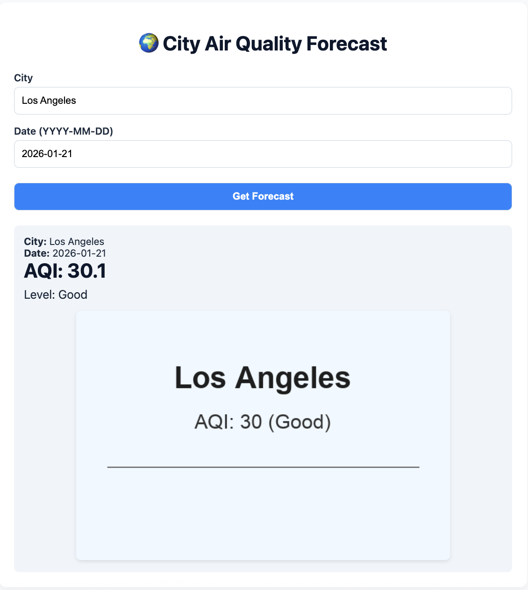

# Global City Air Quality Forecasting System  
*Local Simulation of an AWS-Native Architecture for Demonstration*

This project demonstrates a full-stack system that predicts 24-hour Air Quality Index (AQI) for cities worldwide. It simulates an AWS cloud architecture locally using open-source tools, featuring:
- **Enterprise API** for programmatic forecasts
- **Personalized web interface** with AI-generated city visuals

The design mirrors a production AWS solution (SageMaker + Bedrock + API Gateway), but runs entirely on your machine for cost-free validation.

---

## Installation

1. **Create a virtual environment** (Python 3.11 recommended):
   ```bash
   python -m venv aqi-env
   source aqi-env/bin/activate  # Linux/macOS
   # aqi-env\Scripts\activate  # Windows
   ```

2. **Install dependencies**:
   ```bash
   pip install -r requirements.txt
   ```

---

## Model Training Phase

### Step 1: Data Extraction & Storage
Run the following commands **in sequence** to fetch and preprocess raw data:

```bash
python noaa_extract.py    # Downloads historical weather data from NOAA GSOD
python openaq_extract.py  # Fetches air quality measurements from OpenAQ
python calc_aqi.py        # Calculates daily AQI from raw pollutant concentrations
```

> ✅ Output: Downloads raw data in `data/raw/` and processes CSV files in `data/processed/` directory.

### Step 2: Data Fusion & Post-processing
Merge and clean datasets for modeling:

```bash
python merge.py
```

> ✅ Output: Generates `data/processed/noaa_openaq_aqi_frshtt.csv`.

### Step 3: Machine Learning Development & Training
Train the AutoGluon model:

```bash
python train.py
```

> ✅ Output: Saves trained model to `data/ag_models/`.

---

## Model Deployment & Service

### Step 1: Start the Prediction API
Launch the FastAPI server (simulates SageMaker Endpoint + API Gateway):

```bash
uvicorn src.api:app --reload --port 8000
```

> ✅ Verify at: [http://localhost:8000/docs](http://localhost:8000/docs)

### Step 2: Enterprise User Demo
Run the enterprise client script (programmatic API usage):

```bash
python demo_ent.py
```

**Expected Terminal Output**:
```
Status Code: 200
Response: {'city': 'Los Angeles', 'date': '2026-01-21', 'predicted_aqi': 30.1, 'aqi_level': 'Good'}
```

### Step 3: Individual User Demo
Run the individual user script (includes image generation):

```bash
python demo_ind.py
```

**Expected Terminal Output**:
```
Loading model from afp/src/../data/ag_models...
{'city': 'Los Angeles', 'date': '2026-01-21', 'predicted_aqi': 30.1, 'aqi_level': 'Good'}
Image at: afp/src/../frontend/images/los_angeles_aqi_30.png
```

### Step 4: Web Interface Demo
1. Open `frontend/index.html` in your browser  
   (Use VS Code Live Server or run `python -m http.server 8080` in `frontend/` for best results)
2. Click **"Get Forecast"**

**Expected Webpage Effect**:  
  
*(Screenshot shows AQI result + generated city image)*

> 💡 **Note**: The image is a Pillow-generated placeholder (see `src/genai.py`). For real GenAI output, see `src/genai_sd.py`.

---

## Image Generation Implementation

### Current Approach (Default)
- **File**: `src/genai.py`
- **Method**: Uses `Pillow` to create clean, informative mock images with city name and AQI level
- **Why?**: Avoids heavy dependencies (`torch`, `diffusers`) and version conflicts with AutoGluon
- **Output Example**:  
  

### Stable Diffusion Alternative (Reference Only)
- **File**: `src/genai_sd.py`
- **Method**: Demonstrates how to integrate **Stable Diffusion** via Hugging Face `diffusers` for photorealistic images
- **Status**: **Not enabled by default** due to:
  - Large model download (~5GB)
  - GPU requirement for reasonable speed
  - Dependency conflicts with AutoGluon 1.4.0

> 🔜 **Cloud Migration Path**: In AWS, replace `genai.py` with **Amazon Bedrock** (Stable Diffusion XL) – no local GPU or model management required.

---


## 📝 Notes
- **For demonstration only**: This local prototype simulates cloud architecture patterns.
- **To deploy on AWS**: Replace `src/genai.py` with Bedrock calls and deploy `src/api.py` on SageMaker.
- **Troubleshooting**: Ensure all training steps complete before running demos. Check `data/ag_models/` directory for saved model.

> Designed to showcase **serverless ML + GenAI** concepts without cloud costs.